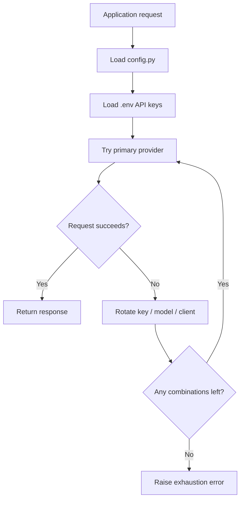

# LLM-Gateway-Service


> A configuration-first multi-provider LLM routing layer that automatically rotates API keys, client providers, and model candidates when a request fails due to exhaustion, invalid credentials, or model-specific limits.

## Overview

LLM-Gateway-Service is a lightweight Python project for teams that operate across multiple LLM providers and need deterministic failover without building custom retry logic in every application.

The project is designed around a single operational idea: developers should define provider pools and debugging behavior in `config.py`, populate API keys in `.env`, and let the orchestration layer handle client rotation when one provider or model becomes unavailable. That makes it suitable for production workloads where reliability matters more than coupling to a single vendor.

The repository currently centers on three provider families:

- Groq
- Google Gemini
- Cerebras

## Badges

| Badge | Meaning |
| --- | --- |
|  | Python implementation |
|  | Multi-provider failover design |
|  | Update once a formal license is chosen |

## Key Features

| Capability | Technical Detail |
| --- | --- |
| Provider rotation | Requests can move across Groq, Gemini, and Cerebras client pools without changing application code. |
| Key pool management | Each provider can be backed by multiple API keys, allowing the runtime to continue when a single key expires or is rate-limited. |
| Model pool fallback | Ordered model lists in `config.py` act as a preference chain, so the router can try alternate models before surfacing a failure. |
| Debug visibility | `DEBUG` and `IN_DEPTH_DEBUG` control log verbosity so you can switch between concise operational logs and deep request tracing. |
| Centralized configuration | Provider counts, model lists, and debug mode live in one place instead of being duplicated across call sites. |
| Failure isolation | Provider-specific errors do not have to terminate the entire workflow if another valid key/model combination is still available. |

## How It Works



The intended behavior is simple:

1. Read provider preferences, model lists, and key counts from `config.py`.
2. Load API credentials from the environment.
3. Attempt a request with the active provider/model combination.
4. On provider failure, rotate through the next key or model.
5. When a provider pool is exhausted, move to the next client family.
6. Stop only when every configured combination has been tried.

> The repo is built for operational resilience, not for single-provider purity.

## Project Structure

```text
LLM-Gateway-Service/
├── config.py           # Provider lists, key counts, and debug switches
├── Exceptions.py       # Custom exception types used by the orchestration layer
├── LLMClients.py       # Abstract client contract and provider-specific routing logic
├── LLMOrchestrator.py  # Top-level orchestration entry point
├── requirements.txt    # Python dependencies
├── .env.template       # Example environment variables for API keys
└── README.md           # Project documentation
```

## Installation

<details>
<summary>Local setup</summary>

1. Clone the repository.

```bash
git clone <repository-url>
cd LLM-Gateway-Service
```

2. Create and activate a virtual environment.

```bash
python3 -m venv .venv
source .venv/bin/activate
```

3. Install dependencies.

```bash
pip install --upgrade pip
pip install -r requirements.txt
```

</details>

<details>
<summary>Environment variables</summary>

Copy `.env.template` to `.env` and populate the keys for every provider you plan to use.

```bash
cp .env.template .env
```

Example shape:

```env
GROQ_API_KEY0=...
GROQ_API_KEY1=...
GROQ_API_KEY2=...

GEMINI_API_KEY0=...
GEMINI_API_KEY1=...
GEMINI_API_KEY2=...

CEREBRAS_API_KEY0=...
CEREBRAS_API_KEY1=...
CEREBRAS_API_KEY2=...
```

Keep the number of indexed keys aligned with the counts in `config.py`. If you change the number of active keys, update the corresponding `*_KEY` value in `config.py` so the router knows how many credentials to scan.

</details>

<details>
<summary>Dependencies</summary>

The project relies on the following core packages:

| Package | Purpose |
| --- | --- |
| `groq` | Groq client integration |
| `google-genai` | Gemini client integration |
| `cerebras_cloud_sdk` | Cerebras client integration |
| `python-dotenv` | Loads environment variables from `.env` |
| `tenacity` | Retry primitives for failure handling |

Install them with `pip install -r requirements.txt`.

</details>

<details>
<summary>Build / verification steps</summary>

This repository is a Python library-style project rather than a packaged service, so the essential validation step is import verification plus a smoke test in your host application.

```bash
python -m compileall .
python - <<'PY'
from config import DEBUG, IN_DEPTH_DEBUG, GROQ_MODEL
print("config loaded:", DEBUG, IN_DEPTH_DEBUG, GROQ_MODEL)
PY
```

</details>

## Configuration

`config.py` is the primary customization point.

| Setting | Role |
| --- | --- |
| `DEBUG` | Enables the main debug statement stream. |
| `IN_DEPTH_DEBUG` | Enables detailed trace output for low-level troubleshooting. |
| `GROQ_MODEL` | Ordered Groq model preference list. |
| `GEMINI_MODEL` | Ordered Gemini model preference list. |
| `CEREBRAS_MODEL` | Ordered Cerebras model preference list. |
| `GROQ_KEY` | Number of Groq API keys to scan. |
| `GEMINI_KEY` | Number of Gemini API keys to scan. |
| `CEREBRAS_KEY` | Number of Cerebras API keys to scan. |

Recommended operating model:

```python
DEBUG = 1
IN_DEPTH_DEBUG = 0

GROQ_MODEL = ["openai/gpt-oss-120b", "llama-3.3-70b-versatile"]
GEMINI_MODEL = ["gemini-2.5-flash"]
CEREBRAS_MODEL = ["gpt-oss-120b"]

GROQ_KEY = 2
GEMINI_KEY = 1
CEREBRAS_KEY = 1
```

## Usage

The repository is designed to be integrated into an application layer that calls the orchestrator or provider client abstraction. A typical integration pattern is:

```python
from dotenv import load_dotenv
from config import DEBUG, IN_DEPTH_DEBUG

load_dotenv()

# Wire your application entry point to the orchestrator layer here.
# The router will then try the configured provider/model/key pools
# and rotate automatically when a request fails.
```

### Debugging flow

When `DEBUG` and `IN_DEPTH_DEBUG` are enabled, the router is expected to emit trace information around:

- selected provider family
- chosen model
- active API key index
- retry or rotation reason
- exhaustion state when no valid combinations remain

## API / CLI

No standalone CLI or HTTP API is exposed in this repository snapshot.

The public surface is intentionally library-oriented:

- `config.py` controls behavior
- `LLMClients.py` defines the client abstraction
- `LLMOrchestrator.py` is the orchestration boundary

If you add a CLI later, document it here with exact command syntax and exit codes.

## Deployment

Because this project is a routing library, deployment usually means shipping it as part of a larger Python service or worker.

### Recommended deployment checklist

1. Pin dependencies with `requirements.txt`.
2. Inject secrets through the runtime environment, not source control.
3. Set `DEBUG = 0` and `IN_DEPTH_DEBUG = 0` for production unless you are actively diagnosing issues.
4. Validate all required API keys are present before starting the process.
5. Run the host service behind your preferred process manager, container runtime, or platform scheduler.

### Containerized deployment

If you package the project into a container, copy only the source files, install requirements, and mount secrets through environment variables or secret storage.

```dockerfile
FROM python:3.11-slim

WORKDIR /app
COPY requirements.txt .
RUN pip install --no-cache-dir -r requirements.txt

COPY . .
CMD ["python", "-c", "import config; print('LLM-Gateway-Service ready')"]
```

## Screenshots

> Screenshot placeholder: add an architecture diagram or runtime trace capture here once the project has a visual demo surface.

Suggested assets for a production repository:

- request-routing diagram
- provider rotation log snippet
- environment setup screenshot

## Troubleshooting

| Symptom | Likely Cause | Resolution |
| --- | --- | --- |
| Import error for a provider SDK | Dependencies are missing from the active virtual environment | Re-run `pip install -r requirements.txt` inside the activated environment. |
| Requests stop after one provider fails | No fallback keys or models are configured | Add more keys to `.env` and expand the model pool in `config.py`. |
| All requests fail immediately | Environment variables are missing or misnamed | Verify `.env` matches `.env.template` exactly. |
| Debug logs are too noisy | Verbosity flags are enabled | Set `DEBUG = 0` and `IN_DEPTH_DEBUG = 0` for normal operation. |
| A specific model keeps failing | The model is unsupported, rate-limited, or exhausted | Remove it from the preference list or move it later in the rotation order. |

## Contributing

Contributions are welcome if they improve correctness, observability, or provider coverage.

Please keep pull requests focused and include:

- a concise description of the routing behavior being changed
- reproduction steps for any failure-handling update
- updates to `.env.template` and `config.py` when configuration contracts change
- tests or a clear validation checklist when the orchestration flow changes

Guidelines:

1. Do not hard-code secrets.
2. Preserve backward-compatible configuration names whenever possible.
3. Keep provider rotation behavior deterministic and well logged.
4. Prefer small, isolated changes to client adapters and error handling.

## Roadmap

Planned improvements that would strengthen the project further:

- formal public orchestration API with documented inputs and return types
- structured logging with request IDs and provider attempt history
- health checks for provider pools and exhausted key detection
- test coverage for failover, invalid-key handling, and model rotation
- optional CLI for smoke testing provider credentials
- metrics hooks for success rate, fallback rate, and exhaustion rate

## Acknowledgements

LLM-Gateway-Service builds on the ecosystem provided by:

- Groq
- Google Gemini / Google Gen AI SDK
- Cerebras Cloud SDK
- python-dotenv
- tenacity

It also follows a common open-source reliability pattern: fail over without forcing callers to understand vendor-specific error recovery.

## License

License: TBD.

Add the repository's chosen license here once it is finalized, and keep the license file in sync with this section.

