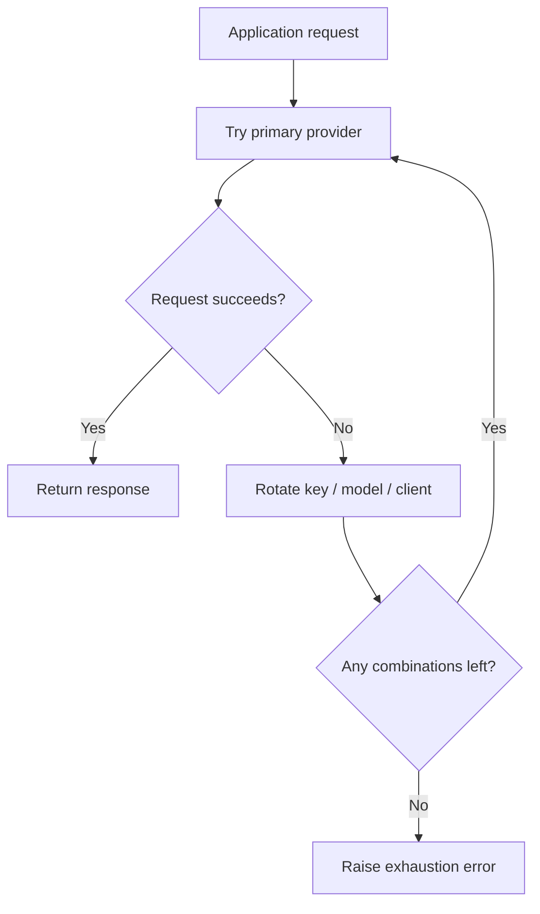

# PolyRouter


PolyRouter is a lightweight Python library that routes requests across multiple LLM providers. It helps applications achieve deterministic failover by rotating API keys, client providers, and model candidates when requests fail.

## Overview

This repository provides an orchestration layer that can be embedded in your application to manage provider rotation, API-key pools, and model fallbacks. Keys are loaded from the environment (see `.env`), and the orchestrator tries configured provider/model/key combinations until a request succeeds or all combinations are exhausted.

Example provider adapters included in this snapshot:

- Groq
- Google Gemini
- Cerebras

## Key Features

| Capability                | Technical Detail                                                                                                                 |
| ------------------------- | -------------------------------------------------------------------------------------------------------------------------------- |
| Provider rotation         | Requests can move across Groq, Gemini, and Cerebras client pools without changing application code.                              |
| Key pool management       | Each provider can be backed by multiple API keys, allowing the runtime to continue when a single key expires or is rate-limited. |
| Model pool fallback       | Ordered model lists in `LLMOrchestrator` act as a preference chain, so the router can try alternate models before surfacing a failure. |
| Debug visibility          | `DEBUG` and `VERBOSE` control log verbosity so you can switch between concise operational logs and deep request tracing.  |
| Centralized configuration | Provider counts, model lists, and debug mode live in one place instead of being duplicated across call sites.                    |
| Failure isolation         | Provider-specific errors do not have to terminate the entire workflow if another valid key/model combination is still available. |

## How It Works



The intended behavior is simple:

1. Read provider preferences, model lists, and key counts passed in `LLMOrchestrator`.
2. Attempt a request with the active provider/model combination.
3. On provider failure, rotate through the next key or model.
4. When a provider pool is exhausted, move to the next client family.
5. Stop only when every configured combination has been tried.

> The repo is built for operational resilience, not for single-provider purity.

## Project Structure

```text
PolyRouter/
├── examples/                # Example usage scenarios
│   └── basic_usage.py
├── polyrouter/              # Library source
│   ├── Exceptions.py
│   ├── LLMClients.py
│   ├── LLMOrchestrator.py
│   └── __init__.py
├── .env-snapshot            # (example present in repo snapshot)
├── requirements-dev.txt     # Development / runtime deps
└── README.md
```

## Installation

Local setup (recommended):

```bash
git clone <repository-url>
cd PolyRouter
python3.11 -m venv .venv # can use other version as well, preferred >=3.11
source .venv/bin/activate
pip install --upgrade pip
pip install -r requirements-dev.txt
```

### Environment variables

This repo includes a `.env-snapshot` file in the snapshot. In normal usage copy and populate a local `.env` (do not commit secrets):

```bash
cp .env-snapshot .env
# edit .env and export provider API keys, e.g.:
# GROQ_API_KEY0=...
# GEMINI_API_KEY0=...
```

The examples use environment variables named like `GROQ_API_KEY0`, `GEMINI_API_KEY0`, etc.

## Usage

See `examples/basic_usage.py` for a minimal example.

When `debug`/`verbose` are enabled the orchestrator logs provider, model and key selection and rotation decisions.

## Deployment

Because this project is a routing library, deployment usually means shipping it as part of a larger Python service or worker.

## License

License: TBD.

Add the repository's chosen license here once it is finalized, and keep the license file in sync with this section.
